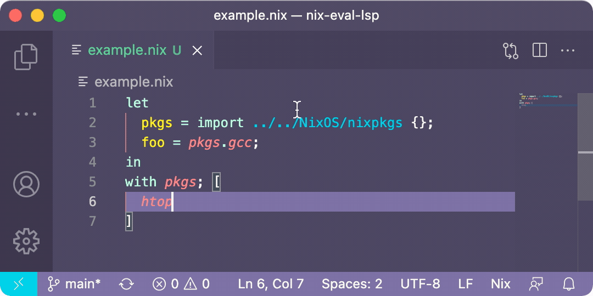

# nix-eval-lsp

`nix-eval-lsp` is an experimental [language server](https://langserver.org/) for [Nix](https://nixos.org). It provides completions and tooltips by efficiently evaluating Nix expressions as they are typed.

<p align="center">
    
</p>

## Features

- [x] hover over an expression to see its value
- [x] auto-complete inside expressions such as `with pkgs; [ <typing here> ]`
- [x] goto definitions across files
- [x] clickable paths and urls
- [ ] auto-formatting using `nixpkgs-fmt`
- [ ] helpful documentation for builtins
- [ ] caching of lambda parameters to make `callPackage` derivations easier to write
- [ ] auto-complete for lambda arguments, with documentation comments extracted from source code
- [ ] snippets for common Nix expressions

**Important note:** the evaluator is developed for the purpose of debugging tools only. It does not aim to correctly implement Nix in its entirety.

## Usage

1. Install the [Nix IDE](https://marketplace.visualstudio.com/items?itemName=jnoortheen.nix-ide) extension for VS Code
2. `git clone https://github.com/aaronjanse/nix-eval-lsp.git && cd nix-eval-lsp`
3. Run `nix build`, `nix-build`, or `RUSTC_BOOTSTRAP=1 cargo build --release` (the `--release` is important!)
4. Copy the absolute path of the built binary into Nix IDE's settings (search "nix" then edit the "server path" field)
5. Make sure "Nix: Enable Language Server" is set to `true`
6. Restart VS Code ("Reload Window" in command palette)

## Try it out

Here's an expression to try out the LSP:

```nix
let
  pkgs = import /path/to/nixpkgs {};
  foo = pkgs.gcc;
in
with pkgs; [
  htop hello
]
```

## Credits

Huge thank you to [@jd91mZM2](https://github.com/jd91mZM2) for [nix-community/rnix-parser](https://github.com/nix-community/rnix-parser).
