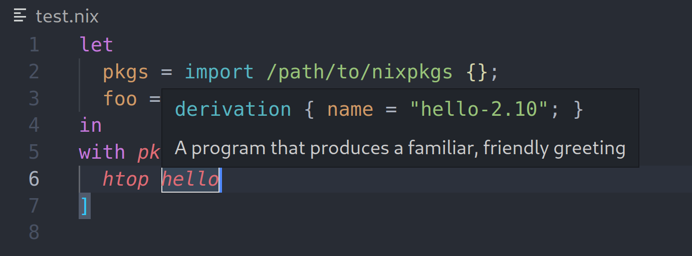
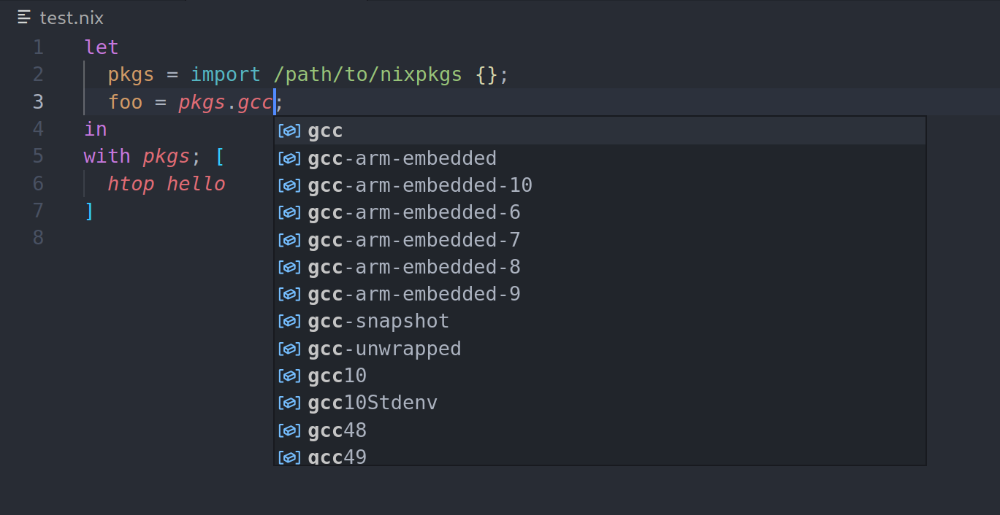

# nix-eval-lsp

`nix-eval-lsp` is a [language server](https://langserver.org/) for [Nix](https://nixos.org) that works by evaluating code as the user interacts with it.




Features:
- [x] hover over an expression to see its value
- [x] auto-complete inside expressions such as `with pkgs; [ <typing here> ]`
- [x] goto definitions across files
- [ ] snippets for common Nix expressions
- [ ] clickable on paths and urls
- [ ] auto-formatting using `nixpkgs-fmt`
- [ ] caching of lambda parameters to make `callPackage` derivations easier to write
- [ ] auto-complete for lambda arguments, with documentation comments extracted from source code
- [ ] documentation for builtins

**Important note:** the evaluator is developed for the purpose of debugging tools only. It does not aim to correctly implement Nix in its entirety.

## Usage Instructions

1. Install the [Nix IDE](https://marketplace.visualstudio.com/items?itemName=jnoortheen.nix-ide) extension for VS Code
2. Clone this repo
3. Run `nix build`, `nix-build`, or `cargo build --release` (the `--release` is important!)
4. Copy the built binary path into Nix IDE's settings (search "nix" then edit the "server path" field)

## Try it out

Here's an expression to try out the LSP:

```nix
let
  pkgs = import /path/to/nixpkgs {};
  foo = pkgs.gcc;
in
with pkgs; [
  htop hello
]
```
